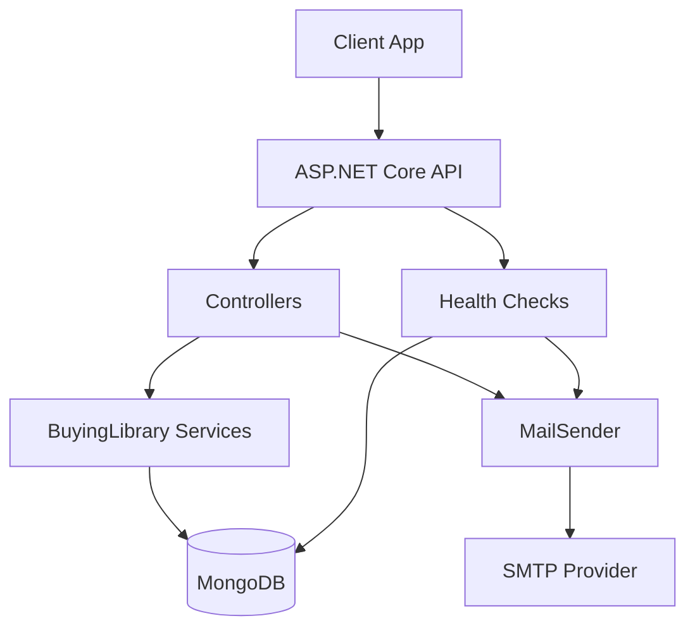
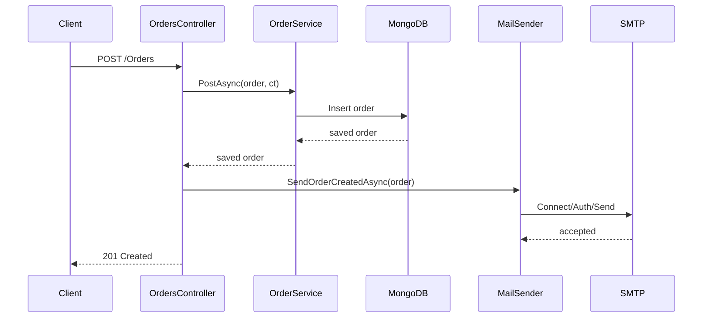
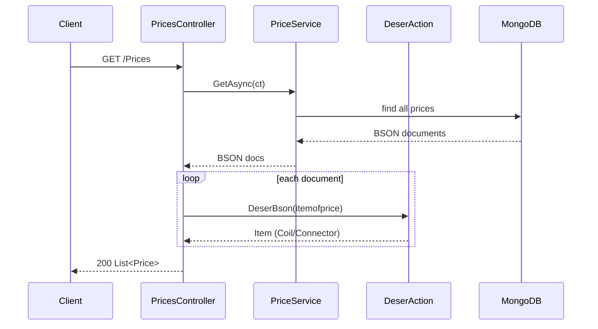

# Architecture and Flow Documentation

## Component diagram



## Sequence: create order



## Sequence: fetch catalog prices



## Deployment/config flow

```mermaid
flowchart LR
  S[appsettings + env vars] --> O[Options binding + validation]
  O --> P[Program startup]
  P --> API[HTTP API]
  P --> HC[/health endpoint]
  API --> M[(MongoDB)]
  API --> SMTP[(SMTP)]
```

## Error model

- Centralized exception handling enabled (`UseExceptionHandler`).
- Validation/guard failures return `400` with problem details payload.
- Missing resources return `404`.

## Versioning approach

- Current implementation keeps existing route set.
- Future recommended: add explicit route versioning (`/api/v1/...`) and non-breaking deprecation policy.
